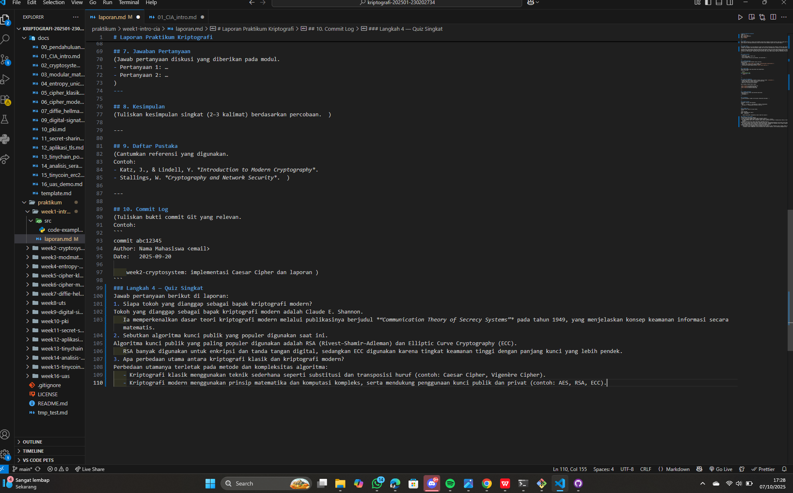

# Laporan Praktikum Kriptografi
Minggu ke-: 1
Topik: [introcia]  
Nama: [Anjani Rahmawati]  
NIM: [230202734]  
Kelas: [5IKRB]  

---

## 1. Tujuan
Tujuan dari praktikum ini adalah untuk memahami konsep dasar keamanan informasi melalui tiga pilar utama CIA Triad (Confidentiality, Integrity, Availability). Selain itu, mahasiswa diharapkan dapat mengenali pentingnya penerapan prinsip CIA dalam sistem keamanan digital dan jaringan komputer.

---

## 2. Dasar Teori
Kriptografi merupakan ilmu yang mempelajari teknik untuk menjaga kerahasiaan dan keamanan informasi agar tidak dapat diakses oleh pihak yang tidak berwenang. Dalam dunia keamanan informasi, terdapat tiga komponen utama yang dikenal sebagai CIA Triad, yaitu Confidentiality, Integrity, dan Availability.  

Confidentiality (Kerahasiaan) memastikan bahwa data hanya dapat diakses oleh pihak yang berwenang melalui teknik seperti enkripsi.  
Integrity (Integritas) menjamin bahwa data tidak diubah tanpa izin, dengan cara verifikasi menggunakan hash atau tanda tangan digital.  
Availability (Ketersediaan)  memastikan bahwa sistem dan data selalu dapat diakses kapan pun dibutuhkan oleh pengguna yang berhak.

---

## 3. Alat dan Bahan
(- Python 3.x  
- Visual Studio Code / editor lain  
- Git dan akun GitHub  
- Library tambahan (misalnya pycryptodome, jika diperlukan)  )

---

## 4. Langkah Percobaan
(Tuliskan langkah yang dilakukan sesuai instruksi.  
Contoh format:
1. Membuat file `caesar_cipher.py` di folder `praktikum/week2-cryptosystem/src/`.
2. Menyalin kode program dari panduan praktikum.
3. Menjalankan program dengan perintah `python caesar_cipher.py`.)

---

## 5. Source Code
(Salin kode program utama yang dibuat atau dimodifikasi.  
Gunakan blok kode:

```python
# contoh potongan kode
def encrypt(text, key):
    return ...
```
)

---

## 6. Hasil dan Pembahasan
(- Lampirkan screenshot hasil eksekusi program (taruh di folder `screenshots/`).  
- Berikan tabel atau ringkasan hasil uji jika diperlukan.  
- Jelaskan apakah hasil sesuai ekspektasi.  
- Bahas error (jika ada) dan solusinya. 

Hasil eksekusi program Caesar Cipher:



)

---

## 7. Jawaban Pertanyaan
1. Siapa tokoh yang dianggap sebagai bapak kriptografi modern?  
Tokoh yang dianggap sebagai bapak kriptografi modern adalah Claude E. Shannon.  
   Ia memperkenalkan dasar teori kriptografi modern melalui publikasinya berjudul *“Communication Theory of Secrecy Systems”* pada tahun 1949, yang menjelaskan konsep keamanan informasi secara matematis.
2. Sebutkan algoritma kunci publik yang populer digunakan saat ini.
Algoritma kunci publik yang paling populer digunakan adalah RSA (Rivest–Shamir–Adleman) dan Elliptic Curve Cryptography (ECC).  
   RSA banyak digunakan untuk enkripsi dan tanda tangan digital, sedangkan ECC digunakan karena tingkat keamanan tinggi dengan panjang kunci yang lebih pendek.  
3. Apa perbedaan utama antara kriptografi klasik dan kriptografi modern?  
Perbedaan utamanya terletak pada metode dan kompleksitas algoritma:
   - Kriptografi klasik menggunakan teknik sederhana seperti substitusi dan transposisi huruf (contoh: Caesar Cipher, Vigenère Cipher).  
   - Kriptografi modern menggunakan prinsip matematika dan komputasi kompleks, serta mendukung penggunaan kunci publik dan privat (contoh: AES, RSA, ECC).
---

## 8. Kesimpulan
Berdasarkan percobaan yang telah dilakukan, dapat disimpulkan bahwa konsep CIA Triad (Confidentiality, Integrity, Availability) merupakan dasar penting dalam menjaga keamanan informasi di sistem digital. Melalui penerapan prinsip-prinsip tersebut, data dapat terlindungi dari akses tidak sah, perubahan tanpa izin, serta tetap tersedia bagi pengguna yang berhak. Praktikum ini membantu memahami bagaimana konsep keamanan informasi diterapkan dalam kriptografi secara praktis.

---.

## 9. Daftar Pustaka
(Cantumkan referensi yang digunakan.  
Contoh:  
- Katz, J., & Lindell, Y. *Introduction to Modern Cryptography*.  
- Stallings, W. *Cryptography and Network Security*.  )

---

## 10. Commit Log
(Tuliskan bukti commit Git yang relevan.  
Contoh:
```
commit abc12345
Author: Anjani Rahmawati <anjanirahmawati@gmail.com>
Date:   2025-09-20

    week2-cryptosystem: implementasi Caesar Cipher dan laporan )
```
