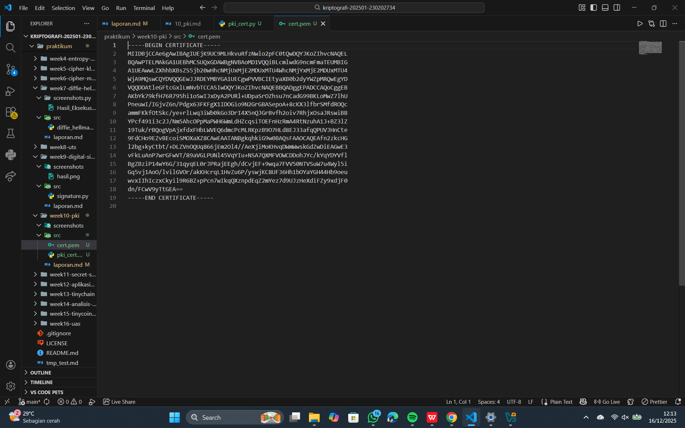

# Laporan Praktikum Kriptografi
Minggu ke-: 10  
Topik: [pki]  
Nama: [Anjani rahmawati]  
NIM: [230202734]  
Kelas: [5IKRB]  

---

## 1. Tujuan

### 1. Membuat Sertifikat Digital Sederhana
Sertifikat digital sederhana dapat dibuat dengan menghasilkan pasangan kunci publik dan privat, kemudian mengikat identitas pemilik (misalnya nama atau domain) dengan public key tersebut. Sertifikat ini biasanya ditandatangani secara mandiri (self-signed certificate) menggunakan private key pemilik atau CA lokal. Sertifikat digital berisi informasi identitas, public key, masa berlaku, dan tanda tangan digital sebagai bukti keabsahan.

---

### 2. Peran Certificate Authority (CA) dalam Sistem PKI
Certificate Authority (CA) berperan sebagai pihak tepercaya yang menerbitkan dan memvalidasi sertifikat digital. CA melakukan verifikasi identitas pemohon sertifikat sebelum menerbitkannya, sehingga public key yang ada pada sertifikat benar-benar milik entitas yang sah. Dalam sistem PKI, CA membangun kepercayaan, mencegah pemalsuan identitas, serta mengelola masa berlaku dan pencabutan sertifikat.

---

### 3. Fungsi PKI dalam Komunikasi Aman (HTTPS, TLS)
Public Key Infrastructure (PKI) berfungsi sebagai fondasi keamanan komunikasi digital dengan menyediakan mekanisme otentikasi, kerahasiaan, dan integritas data. Pada HTTPS dan TLS, PKI digunakan untuk memverifikasi identitas server melalui sertifikat digital, melakukan pertukaran kunci secara aman, serta mengenkripsi data yang dikirimkan. Dengan PKI, komunikasi antara klien dan server menjadi aman dari penyadapan dan serangan man-in-the-middle.


---

## 2. Dasar Teori

Public Key Infrastructure (PKI) merupakan kerangka kerja kriptografi yang digunakan untuk mengelola kunci publik dan sertifikat digital dalam sistem keamanan informasi. PKI memungkinkan pembuatan sertifikat digital yang mengaitkan identitas suatu entitas dengan kunci publiknya. Sertifikat digital sederhana dapat dibuat secara self-signed dengan menghasilkan pasangan kunci publik dan privat, kemudian menandatangani informasi identitas menggunakan kunci privat tersebut.

Certificate Authority (CA) adalah pihak tepercaya dalam sistem PKI yang bertugas menerbitkan, memverifikasi, dan mengelola sertifikat digital. CA melakukan validasi identitas pemohon sebelum menerbitkan sertifikat sehingga public key yang tercantum benar-benar milik entitas yang sah. Selain itu, CA juga mengelola masa berlaku sertifikat serta pencabutan sertifikat melalui mekanisme Certificate Revocation List (CRL) atau Online Certificate Status Protocol (OCSP).

PKI memiliki peran penting dalam komunikasi aman, seperti pada HTTPS dan protokol TLS. Dalam mekanisme ini, sertifikat digital digunakan untuk mengautentikasi identitas server, melakukan pertukaran kunci secara aman, dan mengenkripsi data yang dikirimkan. Dengan adanya PKI, komunikasi antara klien dan server terlindungi dari penyadapan, pemalsuan identitas, dan serangan man-in-the-middle.

---

## 3. Alat dan Bahan
(- Python 3.x  
- Visual Studio Code / editor lain  
- Git dan akun GitHub  
- Library tambahan (misalnya pycryptodome, jika diperlukan)  )

---

## 4. Langkah Percobaan
(Tuliskan langkah yang dilakukan sesuai instruksi.  
Contoh format:
1. Membuat file `caesar_cipher.py` di folder `praktikum/week2-cryptosystem/src/`.
2. Menyalin kode program dari panduan praktikum.
3. Menjalankan program dengan perintah `python caesar_cipher.py`.)

---

## 5. Source Code
(Salin kode program utama yang dibuat atau dimodifikasi.  
Gunakan blok kode:

```python
from cryptography import x509
from cryptography.x509.oid import NameOID
from cryptography.hazmat.primitives import hashes, serialization
from cryptography.hazmat.primitives.asymmetric import rsa
from datetime import datetime, timedelta

# Generate key pair
key = rsa.generate_private_key(public_exponent=65537, key_size=2048)

# Buat subject & issuer (CA sederhana = self-signed)
subject = issuer = x509.Name([
    x509.NameAttribute(NameOID.COUNTRY_NAME, u"ID"),
    x509.NameAttribute(NameOID.ORGANIZATION_NAME, u"UPB Kriptografi"),
    x509.NameAttribute(NameOID.COMMON_NAME, u"example.com"),
])

# Buat sertifikat
cert = (
    x509.CertificateBuilder()
    .subject_name(subject)
    .issuer_name(issuer)
    .public_key(key.public_key())
    .serial_number(x509.random_serial_number())
    .not_valid_before(datetime.utcnow())
    .not_valid_after(datetime.utcnow() + timedelta(days=365))
    .sign(key, hashes.SHA256())
)

# Simpan sertifikat
with open("cert.pem", "wb") as f:
    f.write(cert.public_bytes(serialization.Encoding.PEM))

print("Sertifikat digital berhasil dibuat: cert.pem")
```
)

---

## 6. Hasil dan Pembahasan
(- Lampirkan screenshot hasil eksekusi program (taruh di folder `screenshots/`).  
- Berikan tabel atau ringkasan hasil uji jika diperlukan.  
- Jelaskan apakah hasil sesuai ekspektasi.  
- Bahas error (jika ada) dan solusinya. 

Hasil eksekusi program Caesar Cipher:


)

---

## 7. Jawaban Pertanyaan

### 1. Apa fungsi utama Certificate Authority (CA)?
Fungsi utama Certificate Authority (CA) adalah sebagai pihak tepercaya yang menerbitkan dan memvalidasi sertifikat digital. CA memastikan bahwa public key yang terdapat pada sertifikat benar-benar milik entitas yang sah dengan melakukan proses verifikasi identitas sebelum sertifikat diterbitkan. Selain itu, CA juga bertugas mengelola masa berlaku serta pencabutan sertifikat digital.

---

### 2. Mengapa self-signed certificate tidak cukup untuk sistem produksi?
Self-signed certificate tidak cukup untuk sistem produksi karena tidak melibatkan pihak ketiga yang tepercaya. Sertifikat ini ditandatangani oleh pemiliknya sendiri sehingga tidak ada jaminan bahwa identitas pemilik sertifikat benar-benar sah. Akibatnya, browser atau klien tidak dapat mempercayai sertifikat tersebut secara otomatis dan berpotensi menimbulkan risiko keamanan, seperti pemalsuan identitas.

---

### 3. Bagaimana PKI mencegah serangan MITM dalam komunikasi TLS/HTTPS?
PKI mencegah serangan Man-In-The-Middle (MITM) dengan memastikan keaslian identitas server melalui sertifikat digital yang diterbitkan oleh CA tepercaya. Pada saat koneksi TLS/HTTPS, klien akan memverifikasi sertifikat server terhadap CA yang dipercaya. Jika sertifikat valid, klien dapat yakin bahwa public key yang digunakan benar-benar milik server yang dituju, sehingga penyerang tidak dapat menyisipkan diri atau mengganti kunci dalam proses komunikasi.

---

## 8. Kesimpulan

Berdasarkan praktikum yang telah dilakukan, dapat disimpulkan bahwa Public Key Infrastructure (PKI) berperan penting dalam pengelolaan sertifikat digital dan keamanan komunikasi. Certificate Authority (CA) menjadi pihak tepercaya yang menjamin keaslian identitas melalui penerbitan sertifikat digital. Dengan penerapan PKI pada protokol HTTPS dan TLS, komunikasi data dapat berlangsung secara aman, terhindar dari penyadapan dan serangan man-in-the-middle.


---

## 9. Daftar Pustaka
(Cantumkan referensi yang digunakan.  
Contoh:  
- Katz, J., & Lindell, Y. *Introduction to Modern Cryptography*.  
- Stallings, W. *Cryptography and Network Security*.  )

---

## 10. Commit Log
(Tuliskan bukti commit Git yang relevan.  
Contoh:
```
commit abc12345
Author: Anjani rahmawati <anjanirahmawati1204@gmail.com>
Date:   2025-12-16

    week10-pki)
```
