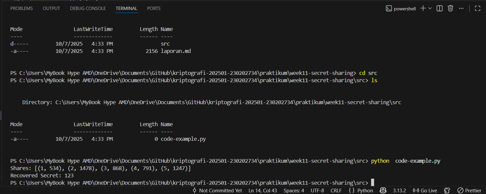

# Laporan Praktikum Kriptografi
Minggu ke-: 11  
Topik: [secret-sharing]  
Nama: [Anjani rahmawati]  
NIM: [230202734]  
Kelas: [5IKRB]  

---

## 1. Tujuan
1. Menjelaskan Konsep Shamir’s Secret Sharing (SSS)

Pada praktikum ini, mahasiswa mampu memahami dan menjelaskan bahwa Shamir’s Secret Sharing merupakan metode kriptografi untuk membagi sebuah informasi rahasia menjadi beberapa bagian (shares). Rahasia tersebut hanya dapat direkonstruksi apabila sejumlah minimal bagian tertentu (threshold) digabungkan, sedangkan penggabungan bagian di bawah threshold tidak akan mengungkapkan informasi rahasia apa pun.

2. Melakukan Simulasi Pembagian Rahasia Menggunakan Skema SSS

Mahasiswa mampu melakukan simulasi pembagian rahasia dengan skema Shamir’s Secret Sharing, yaitu dengan menentukan nilai rahasia, jumlah partisipan, dan nilai ambang batas (threshold). Setiap partisipan memperoleh satu bagian rahasia yang dihasilkan dari fungsi polinomial, serta mahasiswa mampu menunjukkan bahwa rahasia dapat dikembalikan dengan benar ketika jumlah bagian yang digunakan memenuhi nilai threshold.

3. Menganalisis Keamanan Skema Distribusi Rahasia

Mahasiswa mampu menganalisis keamanan skema Shamir’s Secret Sharing dengan menjelaskan bahwa sistem ini memiliki tingkat keamanan tinggi karena rahasia tidak dapat diketahui apabila jumlah bagian yang dikumpulkan kurang dari threshold. Skema ini efektif untuk melindungi informasi sensitif dari akses tidak sah dan cocok digunakan pada sistem distribusi kunci dan manajemen keamanan data.

---

## 2. Dasar Teori
Secret Sharing merupakan teknik kriptografi yang digunakan untuk membagi sebuah informasi rahasia menjadi beberapa bagian (shares) yang didistribusikan kepada sejumlah pihak. Tujuan utama dari skema ini adalah memastikan bahwa rahasia hanya dapat diakses apabila sejumlah minimum bagian tertentu digabungkan, sementara penggabungan bagian yang kurang dari batas minimum tersebut tidak akan mengungkapkan informasi apa pun. Teknik ini banyak digunakan dalam sistem keamanan data, pengelolaan kunci kriptografi, dan sistem distribusi kepercayaan.

Shamir’s Secret Sharing (SSS) adalah salah satu skema secret sharing yang paling populer dan diperkenalkan oleh Adi Shamir pada tahun 1979. Skema ini bekerja berdasarkan konsep polinomial matematika, di mana nilai rahasia disimpan sebagai konstanta dari suatu polinomial berderajat tertentu. Setiap bagian rahasia diperoleh dengan menghitung nilai polinomial pada titik yang berbeda. Untuk merekonstruksi rahasia, digunakan metode interpolasi polinomial yang memerlukan jumlah bagian minimal sesuai dengan nilai ambang batas (threshold).

Keamanan Shamir’s Secret Sharing terletak pada sifat matematis polinomial, di mana tanpa jumlah bagian yang cukup, tidak mungkin menentukan nilai rahasia secara unik. Hal ini membuat skema SSS memiliki tingkat keamanan yang tinggi, karena pihak yang tidak berwenang tidak dapat memperoleh informasi rahasia meskipun memiliki sebagian bagian rahasia. Oleh karena itu, Shamir’s Secret Sharing sangat efektif digunakan dalam sistem yang membutuhkan keamanan dan keandalan tinggi dalam pengelolaan informasi sensitif.

---

## 3. Alat dan Bahan
(- Python 3.x  
- Visual Studio Code / editor lain  
- Git dan akun GitHub  
- Library tambahan (misalnya pycryptodome, jika diperlukan)  )

---

## 4. Langkah Percobaan
(Tuliskan langkah yang dilakukan sesuai instruksi.  
Contoh format:
1. Membuat file `caesar_cipher.py` di folder `praktikum/week2-cryptosystem/src/`.
2. Menyalin kode program dari panduan praktikum.
3. Menjalankan program dengan perintah `python caesar_cipher.py`.)

---

## 5. Source Code
(Salin kode program utama yang dibuat atau dimodifikasi.  
Gunakan blok kode:

```python
import random

# Membuat shares
def generate_shares(secret, k, n, prime=2087):
    coeffs = [secret] + [random.randint(1, prime-1) for _ in range(k-1)]

    def f(x):
        return sum(coeffs[i] * (x ** i) for i in range(len(coeffs))) % prime

    shares = [(i, f(i)) for i in range(1, n+1)]
    return shares

# Rekonstruksi secret (Lagrange)
def reconstruct_secret(shares, prime=2087):
    secret = 0
    for i, (xi, yi) in enumerate(shares):
        num, den = 1, 1
        for j, (xj, _) in enumerate(shares):
            if i != j:
                num = (num * (-xj)) % prime
                den = (den * (xi - xj)) % prime
        secret = (secret + yi * num * pow(den, -1, prime)) % prime
    return secret


# ======================
# CONTOH PENGGUNAAN
# ======================
secret = 123
k = 3
n = 5

shares = generate_shares(secret, k, n)
print("Shares:", shares)

recovered = reconstruct_secret(shares[:3])
print("Recovered Secret:", recovered)

```
)

---

## 6. Hasil dan Pembahasan
(- Lampirkan screenshot hasil eksekusi program (taruh di folder `screenshots/`).  
- Berikan tabel atau ringkasan hasil uji jika diperlukan.  
- Jelaskan apakah hasil sesuai ekspektasi.  
- Bahas error (jika ada) dan solusinya. 

Hasil eksekusi program Caesar Cipher:



)

---

## 7. Jawaban Pertanyaan
1. Apa keuntungan utama Shamir Secret Sharing dibanding membagikan salinan kunci secara langsung?

Keuntungan utama Shamir Secret Sharing adalah keamanan yang lebih tinggi, karena rahasia tidak disalin secara utuh ke setiap pihak. Jika satu atau beberapa bagian rahasia bocor, informasi rahasia tetap aman selama jumlah bagian yang bocor belum mencapai nilai threshold. Berbeda dengan pembagian salinan kunci secara langsung, di mana kebocoran satu salinan saja sudah cukup untuk membahayakan seluruh sistem.

2. Apa peran threshold (k) dalam keamanan secret sharing?

Threshold (k) berfungsi sebagai batas minimum jumlah bagian rahasia yang harus digabungkan untuk merekonstruksi rahasia. Nilai threshold menentukan tingkat keamanan dan toleransi kesalahan sistem. Semakin besar nilai k, semakin tinggi tingkat keamanan karena semakin banyak bagian yang dibutuhkan, namun semakin kecil toleransi terhadap kehilangan bagian. Sebaliknya, nilai k yang lebih kecil meningkatkan kemudahan akses tetapi menurunkan tingkat keamanan.

3. Berikan satu contoh skenario nyata di mana SSS sangat bermanfaat.

Salah satu contoh penerapan Shamir Secret Sharing adalah pada penyimpanan kunci enkripsi data penting perusahaan. Kunci enkripsi dibagi ke beberapa manajer atau server berbeda, sehingga kunci hanya dapat digunakan apabila sejumlah pihak tertentu bekerja sama. Hal ini mencegah penyalahgunaan kunci oleh satu pihak saja dan meningkatkan keamanan data dari akses tidak sah.

---

## 8. Kesimpulan
Berdasarkan percobaan yang dilakukan, Shamir’s Secret Sharing terbukti mampu membagi dan merekonstruksi informasi rahasia dengan aman menggunakan konsep threshold. Rahasia hanya dapat dikembalikan apabila jumlah bagian yang digabungkan memenuhi nilai ambang batas yang ditentukan. Skema ini efektif dalam meningkatkan keamanan distribusi rahasia dibandingkan pembagian kunci secara langsung.

---

## 9. Daftar Pustaka
(Cantumkan referensi yang digunakan.  
Contoh:  
- Katz, J., & Lindell, Y. *Introduction to Modern Cryptography*.  
- Stallings, W. *Cryptography and Network Security*.  )

---

## 10. Commit Log
(Tuliskan bukti commit Git yang relevan.  
Contoh:
```
commit abc12345
Author: Nama Mahasiswa <email>
Date:   2025-09-20

    week2-cryptosystem: implementasi Caesar Cipher dan laporan )
```
