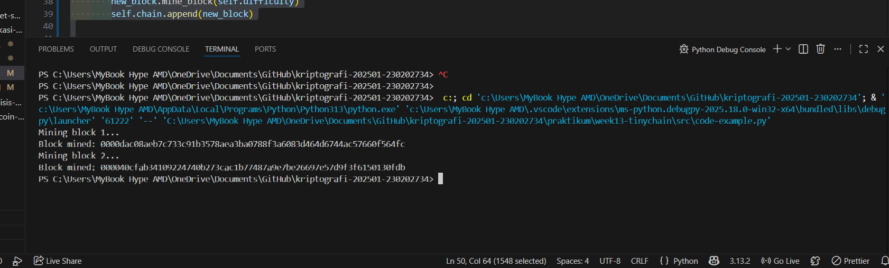

# Laporan Praktikum Kriptografi
Minggu ke-: 13  
Topik: [tinychain]  
Nama: [Anjani rahmawati]  
NIM: [230202734]  
Kelas: [5IKRB]  

---

## 1. Tujuan
1. Menjelaskan Peran Hash Function dalam Blockchain

Pada praktikum ini, mahasiswa mampu menjelaskan bahwa hash function berperan penting dalam menjaga integritas data pada blockchain. Hash digunakan untuk menghubungkan setiap blok dengan blok sebelumnya, sehingga setiap perubahan data pada satu blok akan mengubah nilai hash dan dapat terdeteksi oleh sistem.

2. Melakukan Simulasi Sederhana Proof of Work (PoW)

Mahasiswa mampu melakukan simulasi mekanisme Proof of Work (PoW) dengan mencari nilai nonce yang menghasilkan hash sesuai dengan tingkat kesulitan tertentu. Melalui simulasi ini, mahasiswa memahami proses penambangan blok serta hubungan antara tingkat kesulitan dan waktu komputasi yang dibutuhkan

3. Menganalisis Keamanan Cryptocurrency Berbasis Kriptografi

Mahasiswa mampu menganalisis bahwa keamanan cryptocurrency bergantung pada penggunaan fungsi hash dan mekanisme Proof of Work. Kombinasi keduanya membuat blockchain sulit dimanipulasi, karena perubahan data memerlukan perhitungan ulang PoW pada banyak blok, sehingga meningkatkan keamanan sistem secara keseluruhan.

---

## 2. Dasar Teori
Tinychain adalah konsep blockchain ringan (lightweight blockchain) yang dirancang untuk lingkungan dengan keterbatasan sumber daya, seperti perangkat Internet of Things (IoT), sistem tertanam (embedded systems), atau jaringan dengan kapasitas komputasi dan penyimpanan rendah. Berbeda dengan blockchain konvensional seperti Bitcoin atau Ethereum yang memerlukan daya komputasi besar dan penyimpanan penuh terhadap seluruh rantai blok, Tinychain meminimalkan ukuran data, kompleksitas konsensus, serta kebutuhan energi, sehingga lebih efisien dan cepat diimplementasikan pada perangkat berskala kecil.

Secara teoritis, Tinychain mengadopsi mekanisme konsensus sederhana dan struktur data yang ringkas untuk menjaga integritas, keaslian, dan keterlacakan data. Pendekatan ini memungkinkan setiap transaksi tetap tervalidasi dan tersinkronisasi tanpa membebani node secara berlebihan. Dengan demikian, Tinychain tetap mempertahankan prinsip dasar blockchain—desentralisasi, transparansi, dan keamanan—namun dalam bentuk yang lebih adaptif terhadap keterbatasan infrastruktur.

Dalam konteks penerapan, Tinychain relevan digunakan pada sistem yang membutuhkan pencatatan data secara aman dan berkelanjutan, seperti pemantauan sensor, log aktivitas perangkat, atau sistem informasi terdistribusi skala kecil. Teori Tinychain menekankan keseimbangan antara keamanan dan efisiensi, sehingga cocok sebagai solusi blockchain alternatif pada lingkungan yang tidak memungkinkan penggunaan blockchain berskala besar.

---

## 3. Alat dan Bahan
(- Python 3.x  
- Visual Studio Code / editor lain  
- Git dan akun GitHub  
- Library tambahan (misalnya pycryptodome, jika diperlukan)  )

---

## 4. Langkah Percobaan
(Tuliskan langkah yang dilakukan sesuai instruksi.  
Contoh format:
1. Membuat file `caesar_cipher.py` di folder `praktikum/week2-cryptosystem/src/`.
2. Menyalin kode program dari panduan praktikum.
3. Menjalankan program dengan perintah `python caesar_cipher.py`.)

---

## 5. Source Code
(Salin kode program utama yang dibuat atau dimodifikasi.  
Gunakan blok kode:

```python
import hashlib
import time

class Block:
    def __init__(self, index, previous_hash, data, timestamp=None):
        self.index = index
        self.timestamp = timestamp or time.time()
        self.data = data
        self.previous_hash = previous_hash
        self.nonce = 0
        self.hash = self.calculate_hash()

    def calculate_hash(self):
        value = str(self.index) + str(self.timestamp) + str(self.data) + str(self.previous_hash) + str(self.nonce)
        return hashlib.sha256(value.encode()).hexdigest()

    def mine_block(self, difficulty):
        while self.hash[:difficulty] != "0" * difficulty:
            self.nonce += 1
            self.hash = self.calculate_hash()
        print(f"Block mined: {self.hash}")


class Blockchain:   # ✅ class harus di luar class Block

    def __init__(self):
        self.chain = [self.create_genesis_block()]
        self.difficulty = 4

    def create_genesis_block(self):
        return Block(0, "0", "Genesis Block")

    def get_latest_block(self):
        return self.chain[-1]

    def add_block(self, new_block):
        new_block.previous_hash = self.get_latest_block().hash
        new_block.mine_block(self.difficulty)
        self.chain.append(new_block)


# Uji coba blockchain
if __name__ == "__main__":
    my_chain = Blockchain()

    print("Mining block 1...")
    my_chain.add_block(Block(1, "", "Transaksi A → B: 10 Coin"))

    print("Mining block 2...")
    my_chain.add_block(Block(2, "", "Transaksi B → C: 5 Coin"))
```
)

---

## 6. Hasil dan Pembahasan
(- Lampirkan screenshot hasil eksekusi program (taruh di folder `screenshots/`).  
- Berikan tabel atau ringkasan hasil uji jika diperlukan.  
- Jelaskan apakah hasil sesuai ekspektasi.  
- Bahas error (jika ada) dan solusinya. 

Hasil eksekusi program Caesar Cipher:



)

---

## 7. Jawaban Pertanyaan
1. Mengapa fungsi hash sangat penting dalam blockchain?
Fungsi hash berperan sebagai pengaman utama data dalam blockchain. Setiap transaksi dan blok diubah menjadi nilai hash unik, sehingga perubahan sekecil apa pun pada data akan menghasilkan hash yang berbeda. Hal ini membuat manipulasi data mudah terdeteksi. Selain itu, hash menghubungkan satu blok dengan blok sebelumnya, sehingga membentuk rantai yang sulit diubah tanpa memodifikasi seluruh blok setelahnya.

2. Bagaimana Proof of Work (PoW) mencegah double spending?
Proof of Work mencegah double spending dengan mewajibkan penambang memecahkan teka-teki kriptografi sebelum transaksi dapat divalidasi dan ditambahkan ke blockchain. Setelah transaksi dicatat dalam blok yang tervalidasi dan dikonfirmasi oleh mayoritas jaringan, transaksi tersebut tidak dapat digunakan kembali. Upaya untuk mengubah transaksi lama akan membutuhkan pengulangan PoW pada blok tersebut dan semua blok setelahnya, yang secara praktis sangat sulit dilakukan.

3. Apa kelemahan dari PoW dalam hal efisiensi energi?
Kelemahan utama PoW adalah konsumsi energi yang sangat besar karena proses komputasi yang intensif dan berulang. Banyak penambang bersaing untuk memecahkan teka-teki yang sama, sehingga menghasilkan pemborosan daya listrik dan biaya operasional tinggi. Hal ini menjadikan PoW kurang ramah lingkungan dan mendorong pengembangan mekanisme konsensus alternatif yang lebih efisien energi, seperti Proof of Stake (PoS).

---

## 8. Kesimpulan
Blockchain mengandalkan fungsi hash dan mekanisme konsensus seperti Proof of Work untuk menjamin keamanan, keutuhan, dan kepercayaan data dalam sistem terdesentralisasi. Fungsi hash memastikan data tidak mudah diubah, sementara PoW berperan mencegah kecurangan seperti double spending melalui proses validasi yang ketat. Namun, meskipun PoW efektif dari sisi keamanan, kelemahan utamanya terletak pada konsumsi energi yang tinggi dan efisiensi yang rendah. Oleh karena itu, diperlukan pengembangan dan penerapan teknologi blockchain yang lebih ringan dan hemat energi, seperti Tinychain atau mekanisme konsensus alternatif, agar blockchain dapat digunakan secara lebih luas dan berkelanjutan.

---

## 9. Daftar Pustaka
(Cantumkan referensi yang digunakan.  
Contoh:  
- Katz, J., & Lindell, Y. *Introduction to Modern Cryptography*.  
- Stallings, W. *Cryptography and Network Security*.  )

---

## 10. Commit Log
(Tuliskan bukti commit Git yang relevan.  
Contoh:
```
commit abc12345
Author: Anjani Rahmawati <anjanirahmawati1204@gmail.com>
Date:   2025-09-20

    week2-cryptosystem: implementasi Caesar Cipher dan laporan )
```
