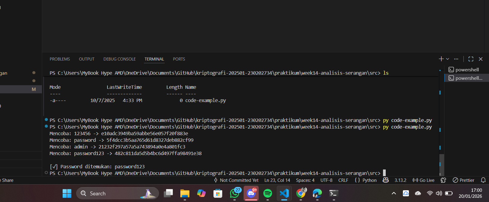

# Laporan Praktikum Kriptografi
Minggu ke-: 14  
Topik: [analisis_serangan]  
Nama: [Anjani rahmawati]  
NIM: [230202734]  
Kelas: [5IKRB]  

---

## Tujuan Pembelajaran

1. Tujuan pertama dari praktikum ini adalah agar mahasiswa mampu mengidentifikasi jenis-jenis serangan kriptografi yang terjadi pada sistem informasi nyata. Mahasiswa diharapkan dapat mengenali pola serangan, metode yang digunakan penyerang, serta memahami konteks terjadinya serangan tersebut dalam lingkungan sistem informasi.

2. Tujuan kedua adalah agar mahasiswa mampu mengevaluasi kelemahan algoritma kriptografi yang digunakan pada sistem yang dianalisis. Evaluasi dilakukan dengan meninjau kekuatan algoritma, kesesuaian penerapannya, serta potensi celah keamanan yang dapat dimanfaatkan oleh pihak tidak bertanggung jawab.

3. Tujuan ketiga adalah agar mahasiswa mampu memberikan rekomendasi algoritma kriptografi yang lebih aman dan sesuai sebagai solusi perbaikan keamanan. Rekomendasi ini diharapkan didasarkan pada hasil analisis serangan dan evaluasi algoritma, sehingga dapat meningkatkan tingkat keamanan sistem informasi secara keseluruhan.


---

## 2. Dasar Teori


Kriptografi merupakan teknik yang digunakan untuk menjaga kerahasiaan, integritas, dan keaslian data dalam sistem informasi. Algoritma kriptografi bekerja dengan cara mengubah data asli (plaintext) menjadi data tersandi (ciphertext) sehingga tidak dapat dibaca oleh pihak yang tidak berwenang. Dalam penerapannya, kriptografi digunakan pada berbagai layanan sistem informasi, seperti autentikasi pengguna, pengamanan komunikasi data, dan perlindungan penyimpanan data.

Serangan kriptografi adalah upaya untuk mengeksploitasi kelemahan pada algoritma, implementasi, atau manajemen kunci kriptografi dengan tujuan memperoleh informasi rahasia atau merusak keamanan sistem. Beberapa jenis serangan yang umum terjadi antara lain brute force attack, cryptanalysis attack, man-in-the-middle attack, dan replay attack. Serangan-serangan ini dapat terjadi apabila algoritma yang digunakan sudah tidak aman, konfigurasi sistem tidak tepat, atau kunci kriptografi dikelola dengan buruk.

Oleh karena itu, evaluasi terhadap algoritma kriptografi yang digunakan menjadi sangat penting untuk memastikan tingkat keamanan sistem informasi. Algoritma yang lemah atau sudah usang perlu diganti dengan algoritma yang lebih kuat dan sesuai standar keamanan terkini. Pemilihan algoritma kriptografi yang tepat, disertai dengan implementasi dan manajemen kunci yang baik, dapat mengurangi risiko serangan serta meningkatkan keamanan sistem secara keseluruhan.


---

## 3. Alat dan Bahan
(- Python 3.x  
- Visual Studio Code / editor lain  
- Git dan akun GitHub  
- Library tambahan (misalnya pycryptodome, jika diperlukan)  )

---

## 4. Langkah Percobaan
(Tuliskan langkah yang dilakukan sesuai instruksi.  
Contoh format:
1. Membuat file `caesar_cipher.py` di folder `praktikum/week2-cryptosystem/src/`.
2. Menyalin kode program dari panduan praktikum.
3. Menjalankan program dengan perintah `python caesar_cipher.py`.)

---

## 5. Source Code
(Salin kode program utama yang dibuat atau dimodifikasi.  
Gunakan blok kode:

```python
import hashlib

# hash MD5 target (contoh: password = "password123")
target_hash = "482c811da5d5b4bc6d497ffa98491e38"

# dictionary sederhana
wordlist = [
    "123456",
    "password",
    "admin",
    "password123",
    "qwerty"
]

def md5_hash(text):
    return hashlib.md5(text.encode()).hexdigest()

for word in wordlist:
    hashed = md5_hash(word)
    print(f"Mencoba: {word} -> {hashed}")
    if hashed == target_hash:
        print(f"\n[✓] Password ditemukan: {word}")
        break

```
)

---

## 6. Hasil dan Pembahasan
(- Lampirkan screenshot hasil eksekusi program (taruh di folder `screenshots/`).  
- Berikan tabel atau ringkasan hasil uji jika diperlukan.  
- Jelaskan apakah hasil sesuai ekspektasi.  
- Bahas error (jika ada) dan solusinya. 

Hasil eksekusi program Caesar Cipher:



)

---

## 7. Jawaban Pertanyaan


1. **Mengapa banyak sistem lama masih rentan terhadap brute force atau dictionary attack?**
   Banyak sistem lama masih rentan karena menggunakan algoritma kriptografi dan metode penyimpanan kata sandi yang sudah tidak aman, seperti hashing tanpa salt atau dengan algoritma lama (misalnya MD5 atau SHA-1). Selain itu, sistem tersebut sering kali tidak menerapkan pembatasan jumlah percobaan login, mekanisme lockout akun, atau pemantauan aktivitas mencurigakan, sehingga memungkinkan penyerang mencoba kombinasi kata sandi secara berulang.

2. **Apa bedanya kelemahan algoritma dengan kelemahan implementasi?**
   Kelemahan algoritma berkaitan dengan desain dasar algoritma kriptografi yang secara teoritis atau praktis sudah dapat dipecahkan. Contohnya adalah algoritma yang sudah tidak direkomendasikan karena ditemukan celah matematis. Sementara itu, kelemahan implementasi terjadi akibat kesalahan dalam penerapan algoritma yang sebenarnya aman, seperti penggunaan kunci yang lemah, konfigurasi yang salah, manajemen kunci yang buruk, atau kesalahan dalam penulisan kode program.

3. **Bagaimana organisasi dapat memastikan sistem kriptografi mereka tetap aman di masa depan?**
   Organisasi dapat memastikan keamanan sistem kriptografi dengan mengikuti standar dan rekomendasi keamanan terbaru, melakukan pembaruan sistem secara berkala, serta mengganti algoritma yang sudah tidak aman. Selain itu, audit keamanan rutin, penerapan manajemen kunci yang baik, pelatihan keamanan bagi staf, dan pemantauan berkelanjutan terhadap ancaman baru juga sangat penting untuk menjaga keamanan sistem di masa depan.

---

## 8. Kesimpulan
Berdasarkan praktikum yang telah dilakukan, dapat disimpulkan bahwa penggunaan algoritma kriptografi yang lemah seperti MD5 sangat rentan terhadap serangan brute force dan dictionary attack. Hasil percobaan menunjukkan bahwa hash password dapat dipecahkan dengan relatif mudah menggunakan daftar kata sederhana. Oleh karena itu, diperlukan penerapan algoritma kriptografi yang lebih kuat dan aman serta konfigurasi sistem yang tepat untuk meningkatkan keamanan sistem informasi.

---

## 9. Daftar Pustaka
(Cantumkan referensi yang digunakan.  
Contoh:  
- Katz, J., & Lindell, Y. *Introduction to Modern Cryptography*.  
- Stallings, W. *Cryptography and Network Security*.  )

---

## 10. Commit Log
```
commit 47249e8b1d5a877ffda19498505f5102e7308158 (HEAD -> main, origin/main, origin/HEAD)
Author: anjanirahmawati <anjanirahmawati1204@gmail.com>
Date:   Tue Jan 20 17:08:51 2026 +0700

    week14-analisis-serangan
```
