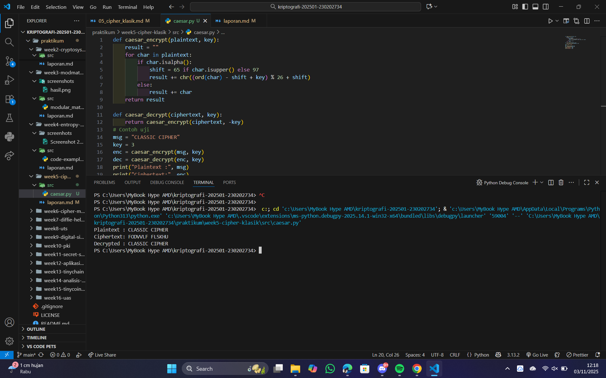
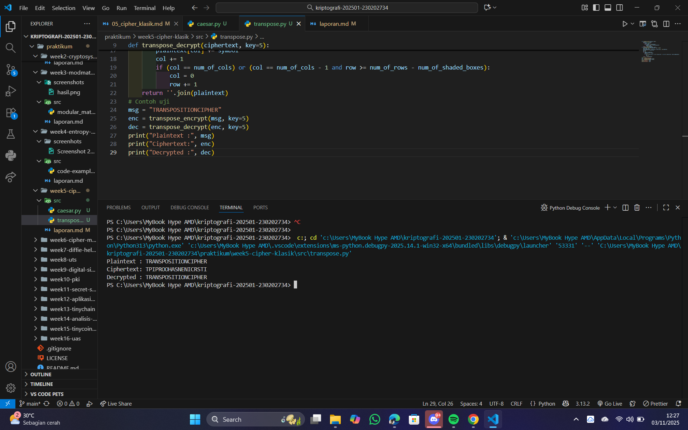
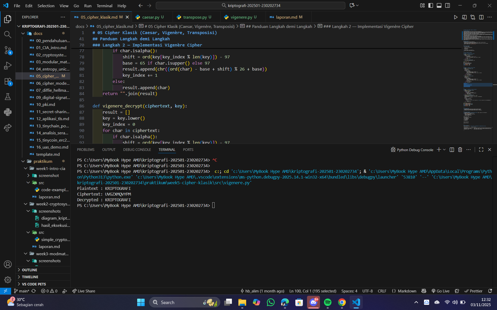

# Laporan Praktikum Kriptografi
Minggu ke-: 5 
Topik: [cipher-klasik]  
Nama: [Anjani Rahmawati]  
NIM: [230202734]  
Kelas: [5IKRB]  

---

## 1. Tujuan
(Tuliskan tujuan pembelajaran praktikum sesuai modul.)

---

## 2. Dasar Teori
(Ringkas teori relevan (cukup 2–3 paragraf).  
Contoh: definisi cipher klasik, konsep modular aritmetika, dll.  )

---

## 3. Alat dan Bahan
(- Python 3.x  
- Visual Studio Code / editor lain  
- Git dan akun GitHub  
- Library tambahan (misalnya pycryptodome, jika diperlukan)  )

---

## 4. Langkah Percobaan
(Tuliskan langkah yang dilakukan sesuai instruksi.  
Contoh format:
1. Membuat file `caesar_cipher.py` di folder `praktikum/week2-cryptosystem/src/`.
2. Menyalin kode program dari panduan praktikum.
3. Menjalankan program dengan perintah `python caesar_cipher.py`.)

---

## 5. Source Code

def caesar_encrypt(plaintext, key):
    result = ""
    for char in plaintext:
        if char.isalpha():
            shift = 65 if char.isupper() else 97
            result += chr((ord(char) - shift + key) % 26 + shift)
        else:
            result += char
    return result

def caesar_decrypt(ciphertext, key):
    return caesar_encrypt(ciphertext, -key)
    def transpose_encrypt(plaintext, key=5):
    ciphertext = [''] * key
    for col in range(key):
        pointer = col
        while pointer < len(plaintext):
            ciphertext[col] += plaintext[pointer]
            pointer += key
    return ''.join(ciphertext)
def transpose_decrypt(ciphertext, key=5):
    num_of_cols = int(len(ciphertext) / key + 0.9999)
    num_of_rows = key
    num_of_shaded_boxes = (num_of_cols * num_of_rows) - len(ciphertext)
    plaintext = [''] * num_of_cols
    col = 0
    row = 0
    for symbol in ciphertext:
        plaintext[col] += symbol
        col += 1
        if (col == num_of_cols) or (col == num_of_cols - 1 and row >= num_of_rows - num_of_shaded_boxes):
            col = 0
            row += 1
    return ''.join(plaintext)

msg = "TRANSPOSITIONCIPHER"
enc = transpose_encrypt(msg, key=5)
dec = transpose_decrypt(enc, key=5)
print("Plaintext :", msg)
print("Ciphertext:", enc)
print("Decrypted :", dec)
# Contoh uji
msg = "CLASSIC CIPHER"
key = 3
enc = caesar_encrypt(msg, key)
dec = caesar_decrypt(enc, key)
print("Plaintext :", msg)
print("Ciphertext:", enc)
print("Decrypted :", dec)
def vigenere_encrypt(plaintext, key):
    result = []
    key = key.lower()
    key_index = 0
    for char in plaintext:
        if char.isalpha():
            shift = ord(key[key_index % len(key)]) - 97
            base = 65 if char.isupper() else 97
            result.append(chr((ord(char) - base + shift) % 26 + base))
            key_index += 1
        else:
            result.append(char)
    return "".join(result)
def vigenere_decrypt(ciphertext, key):
    result = []
    key = key.lower()
    key_index = 0
    for char in ciphertext:
        if char.isalpha():
            shift = ord(key[key_index % len(key)]) - 97
            base = 65 if char.isupper() else 97
            result.append(chr((ord(char) - base - shift) % 26 + base))
            key_index += 1
        else:
            result.append(char)
    return "".join(result)
# Contoh uji
msg = "KRIPTOGRAFI"
key = "KEY"
enc = vigenere_encrypt(msg, key)
dec = vigenere_decrypt(enc, key)
print("Plaintext :", msg)
print("Ciphertext:", enc)
print("Decrypted :", dec)


---

## 6. Hasil dan Pembahasan
(- Lampirkan screenshot hasil eksekusi program (taruh di folder `screenshots/`).  
- Berikan tabel atau ringkasan hasil uji jika diperlukan.  
- Jelaskan apakah hasil sesuai ekspektasi.  
- Bahas error (jika ada) dan solusinya. 

Hasil eksekusi program Caesar Cipher:




)

---

## 7. Jawaban Pertanyaan
1. Kelemahan utama algoritma Caesar Cipher dan Vigenère Cipher
Algoritma Caesar Cipher memiliki kelemahan utama pada ruang kunci yang sangat kecil, yaitu hanya terdiri dari 25 kemungkinan pergeseran huruf. Hal ini membuatnya sangat mudah dipecahkan menggunakan metode brute force, karena penyerang cukup mencoba semua kemungkinan pergeseran untuk menemukan pesan asli. Selain itu, pola huruf pada ciphertext masih sangat mirip dengan plaintext, sehingga rentan terhadap analisis frekuensi. Sedangkan Vigenère Cipher, meskipun lebih kuat karena menggunakan kunci huruf yang berulang, tetap memiliki kelemahan apabila kunci yang digunakan terlalu pendek. Cipher ini dapat dipecahkan menggunakan metode analisis statistik seperti Kasiski atau Friedman Test yang dapat menemukan panjang kunci dan pola perulangan huruf, sehingga keamanannya tidak dapat diandalkan untuk komunikasi modern.
2. Penyebab cipher klasik mudah diserang dengan analisis frekuensi
Cipher klasik mudah diserang karena tidak mengubah distribusi frekuensi huruf pada bahasa alami. Dalam setiap bahasa, terdapat pola frekuensi khas — misalnya huruf “E” sering muncul dalam bahasa Inggris. Ketika teks dienkripsi menggunakan cipher klasik, pola kemunculan huruf tersebut tetap terlihat jelas pada ciphertext. Penyerang dapat menghitung frekuensi kemunculan tiap huruf pada ciphertext dan membandingkannya dengan pola frekuensi bahasa yang dikenal, sehingga dapat menebak huruf-huruf asli dengan mudah. Oleh karena itu, cipher klasik dianggap tidak aman karena masih mempertahankan karakteristik statistik bahasa aslinya.
3. Perbandingan kelebihan dan kelemahan cipher substitusi dan transposisi
Cipher substitusi dan transposisi memiliki prinsip kerja yang berbeda. Cipher substitusi bekerja dengan mengganti setiap huruf pada plaintext dengan huruf lain berdasarkan aturan tertentu, contohnya pada Caesar Cipher atau Vigenère Cipher. Sementara itu, cipher transposisi tidak mengubah hurufnya, melainkan menukar posisi huruf dalam urutan tertentu, seperti pada Columnar Transposition Cipher. Dari segi kelebihan, cipher substitusi lebih sederhana dan mudah dipahami, namun mudah diserang dengan analisis frekuensi karena mengubah huruf tanpa mengacak urutan. Di sisi lain, cipher transposisi lebih sulit dianalisis secara frekuensi karena huruf yang digunakan tetap sama, meskipun posisinya berpindah. Namun, keduanya tetap memiliki kelemahan, sebab dengan kombinasi analisis pola dan percobaan kunci, pesan asli masih dapat ditemukan.

## 8. Kesimpulan
Berdasarkan hasil percobaan, algoritma Caesar Cipher, Vigenère Cipher, dan Transposisi berhasil melakukan proses enkripsi dan dekripsi dengan baik. Setiap algoritma menunjukkan cara kerja yang berbeda, yaitu Caesar Cipher dengan pergeseran huruf tetap, Vigenère Cipher dengan kunci huruf yang bervariasi, dan Transposisi Cipher dengan pengacakan posisi karakter pada teks. Hasil uji menunjukkan bahwa ciphertext yang dihasilkan dapat dikembalikan ke bentuk plaintext semula sesuai dengan teori kriptografi klasik.

---


---

## 10. Commit Log
(Tuliskan bukti commit Git yang relevan.  
Contoh:
```
commit abc12345
Author: Anjani Rahmawati <anjanirahmawati1204@gmil.com>
Date:   2025-09-20

    week2-cryptosystem: implementasi Caesar Cipher dan laporan )
```
