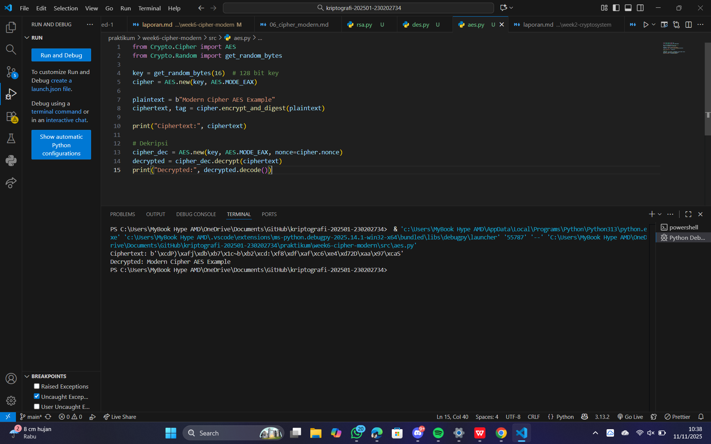
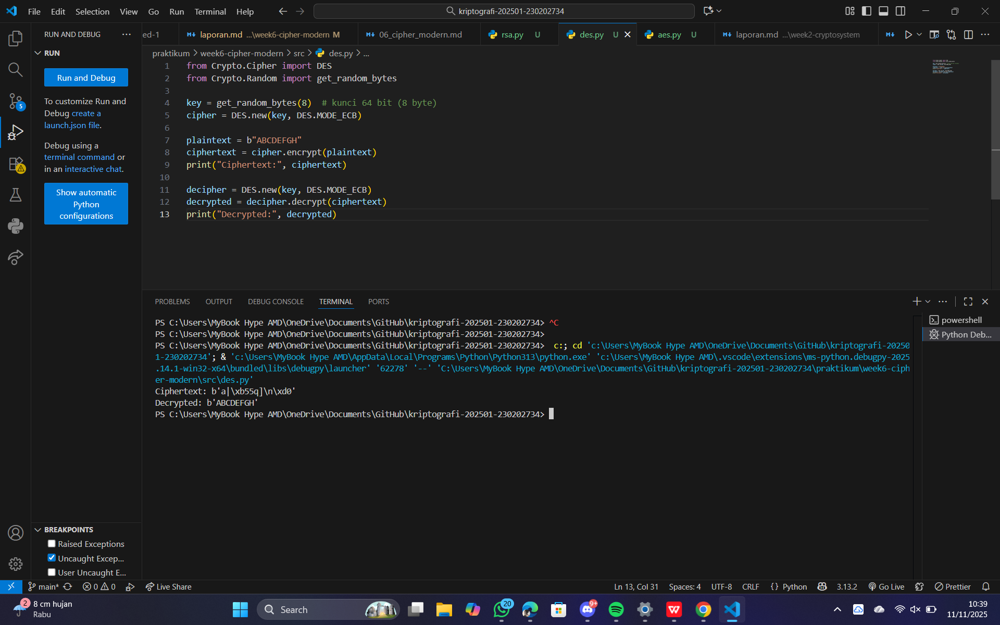
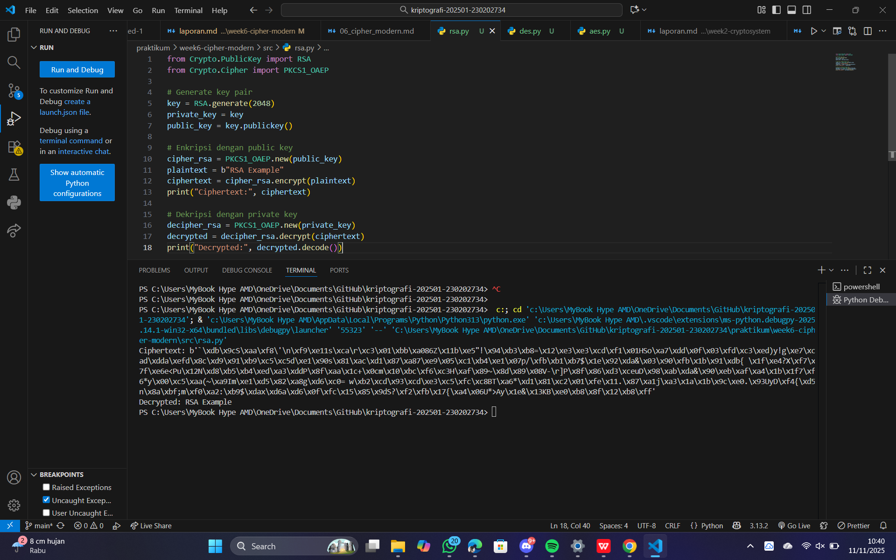

# Laporan Praktikum Kriptografi
Minggu ke-:6 
Topik: [cipher-modern]  
Nama: [Anjani Rahmawati]  
NIM: [230202734]  
Kelas: [5 ikrb]  

---

## 1. Tujuan
1. Mahasiswa mampu memahami konsep dasar kriptografi simetris serta langkah-langkah enkripsi dan dekripsi menggunakan algoritma Data Encryption Standard (DES). Mahasiswa juga dapat menerapkan proses substitusi dan permutasi pada blok data sederhana untuk menunjukkan cara kerja DES secara praktis.

2. Menerapkan algoritma AES dengan panjang kunci 128 bit

Mahasiswa mampu menggunakan algoritma Advanced Encryption Standard (AES) untuk melakukan enkripsi dan dekripsi data dengan panjang kunci 128 bit. Selain itu, mahasiswa dapat menjelaskan tahapan utama AES seperti SubBytes, ShiftRows, MixColumns, dan AddRoundKey, serta memahami keunggulan AES dibandingkan algoritma kriptografi simetris lainnya.
3. Menjelaskan proses pembangkitan kunci publik dan privat pada algoritma RSA

Mahasiswa mampu menjelaskan prinsip dasar kriptografi asimetris dan memahami bagaimana proses pembangkitan pasangan kunci publik dan privat dilakukan pada algoritma Rivest-Shamir-Adleman (RSA). Mahasiswa juga dapat menggambarkan hubungan antara bilangan prima, modulus, dan eksponen yang digunakan dalam proses enkripsi dan dekripsi RSA.

---

## 2. Dasar Teori
Cipher klasik adalah metode penyandian pesan yang digunakan pada masa awal perkembangan kriptografi, sebelum munculnya komputer modern. Cipher ini bekerja dengan cara melakukan substitusi (penggantian huruf dengan huruf lain) atau transposisi (penukaran posisi huruf dalam pesan). Tujuannya adalah untuk menyembunyikan arti pesan agar tidak dapat dibaca oleh pihak yang tidak berwenang.

Contoh cipher klasik antara lain Caesar Cipher, yang mengenkripsi pesan dengan menggeser huruf-huruf dalam alfabet sejumlah langkah tertentu, dan Vigenère Cipher, yang menggunakan kata kunci untuk menentukan pergeseran setiap huruf. Meskipun sederhana, cipher klasik menjadi dasar penting dalam pengembangan algoritma kriptografi modern seperti DES, AES, dan RSA.

---

## 3. Alat dan Bahan
(- Python 3.x  
- Visual Studio Code / editor lain  
- Git dan akun GitHub  
- Library tambahan (misalnya pycryptodome, jika diperlukan)  )

---

## 4. Langkah Percobaan
(Tuliskan langkah yang dilakukan sesuai instruksi.  
Contoh format:
1. Membuat file `caesar_cipher.py` di folder `praktikum/week2-cryptosystem/src/`.
2. Menyalin kode program dari panduan praktikum.
3. Menjalankan program dengan perintah `python caesar_cipher.py`.)

---

## 5. Source Code
(Salin kode program utama yang dibuat atau dimodifikasi.  
Gunakan blok kode:

```python
from Crypto.Cipher import DES
from Crypto.Random import get_random_bytes

key = get_random_bytes(8)  # kunci 64 bit (8 byte)
cipher = DES.new(key, DES.MODE_ECB)

plaintext = b"ABCDEFGH"
ciphertext = cipher.encrypt(plaintext)
print("Ciphertext:", ciphertext)

decipher = DES.new(key, DES.MODE_ECB)
decrypted = decipher.decrypt(ciphertext)
print("Decrypted:", decrypted)
```
```python
from Crypto.Cipher import AES
from Crypto.Random import get_random_bytes

key = get_random_bytes(16)  # 128 bit key
cipher = AES.new(key, AES.MODE_EAX)

plaintext = b"Modern Cipher AES Example"
ciphertext, tag = cipher.encrypt_and_digest(plaintext)

print("Ciphertext:", ciphertext)

# Dekripsi
cipher_dec = AES.new(key, AES.MODE_EAX, nonce=cipher.nonce)
decrypted = cipher_dec.decrypt(ciphertext)
print("Decrypted:", decrypted.decode())
```
```python
from Crypto.PublicKey import RSA
from Crypto.Cipher import PKCS1_OAEP

# Generate key pair
key = RSA.generate(2048)
private_key = key
public_key = key.publickey()

# Enkripsi dengan public key
cipher_rsa = PKCS1_OAEP.new(public_key)
plaintext = b"RSA Example"
ciphertext = cipher_rsa.encrypt(plaintext)
print("Ciphertext:", ciphertext)

# Dekripsi dengan private key
decipher_rsa = PKCS1_OAEP.new(private_key)
decrypted = decipher_rsa.decrypt(ciphertext)
print("Decrypted:", decrypted.decode())
```

)

---

## 6. Hasil dan Pembahasan
(- Lampirkan screenshot hasil eksekusi program (taruh di folder `screenshots/`).  
- Berikan tabel atau ringkasan hasil uji jika diperlukan.  
- Jelaskan apakah hasil sesuai ekspektasi.  
- Bahas error (jika ada) dan solusinya. 

Hasil eksekusi program Caesar Cipher:




)

---

## 7. Jawaban Pertanyaan
1. Perbedaan mendasar antara DES, AES, dan RSA dalam hal kunci dan keamanan

DES (Data Encryption Standard): Algoritma simetris dengan kunci tunggal 56 bit untuk enkripsi dan dekripsi. Keamanan DES kini dianggap lemah karena kunci yang relatif pendek sehingga mudah ditembus oleh serangan brute-force.

AES (Advanced Encryption Standard): Algoritma simetris juga, tetapi mendukung kunci 128, 192, atau 256 bit, sehingga lebih aman dan efisien dibanding DES.

RSA (Rivest–Shamir–Adleman): Algoritma asimetris menggunakan sepasang kunci (publik dan privat). Keamanan RSA bergantung pada kesulitan faktorisasi bilangan prima besar, bukan panjang kunci tunggal seperti DES/AES.
2. Mengapa AES lebih banyak digunakan dibanding DES di era modern

AES lebih populer karena:

Panjang kunci yang lebih besar (128–256 bit), sehingga lebih tahan terhadap serangan brute-force.

Struktur algoritma yang lebih efisien dan cepat pada perangkat modern.

Standar internasional yang menggantikan DES, karena DES sudah tidak lagi aman untuk data sensitif.
3. Mengapa RSA dikategorikan sebagai algoritma asimetris, dan bagaimana proses pembangkitan kuncinya

RSA dikategorikan sebagai algoritma asimetris karena menggunakan dua kunci berbeda:

Kunci publik untuk enkripsi

Kunci privat untuk dekripsi

Proses pembangkitan kunci RSA:
-Pilih dua bilangan prima besar,
-Hitung modulus:n = p × q
-Hitung totien Euler:φ(n) = (p-1) × (q-1)
-pilih eksponden publik e sehingga 1 < e < φ(n) dan e relatif pima terhadap φ(n).
-hitung eksponden privat d sehingga :
d × e ≡ 1 (mod φ(n))
-pasangan kunci : 
kunci publik :(e,n)
kunci privat :(d,n)

---

## 8. Kesimpulan
Berdasarkan percobaan, algoritma DES dan AES dapat mengenkripsi dan mendekripsi data dengan menggunakan kunci simetris, namun AES lebih aman dan efisien karena mendukung panjang kunci yang lebih besar. RSA sebagai algoritma asimetris memungkinkan pengamanan data menggunakan pasangan kunci publik dan privat, sehingga cocok untuk komunikasi yang membutuhkan enkripsi dan tanda tangan digital. Secara keseluruhan, pemilihan algoritma kriptografi harus disesuaikan dengan tingkat keamanan dan kebutuhan aplikasi.

---

## 9. Daftar Pustaka
(Cantumkan referensi yang digunakan.  
Contoh:  
- Katz, J., & Lindell, Y. *Introduction to Modern Cryptography*.  
- Stallings, W. *Cryptography and Network Security*.  )

---

## 10. Commit Log
```
commit 626cab4ceafd9163d4796f2a0847294c870895da (HEAD -> main, origin/main, origin/HEAD)
Author: anjanirahmawati <anjanirahmawati1204@gmail.com>
Date:   Tue Nov 11 10:48:37 2025 +0700

    week6-cipher-modern
```